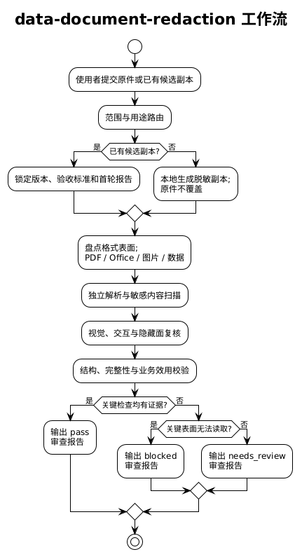

# data-document-redaction

用于生成可用且不泄漏的数据/文档副本，并在文档完成后进行交付前的独立二次审查。支持 CSV、JSON、SQL、表格、PDF、Word、PowerPoint、图片、扫描件和日志。

## 整体架构



PlantUML 源文件：[data-document-redaction-architecture.puml](docs/diagrams/data-document-redaction-architecture.puml)

## 使用方式

```text
Use $data-document-redaction to independently review this completed document and output a privacy-safe audit report.
```

二次审查模式是只读质量门：重新建立独立证据链，检查可见内容、OCR、元数据、批注/修订、附件、链接、文件名、结构和业务效用，并输出 `pass`、`needs_review` 或 `blocked` 结论。它不替代法律/合规认证，也不用于恢复或绕过脱敏。

## 目录

- [主 skill](data-document-redaction/SKILL.md)
- [二次审查流程](data-document-redaction/references/secondary-review.md)
- [文档表面与最低证据](data-document-redaction/references/document-surfaces.md)
- [变换选择矩阵](data-document-redaction/references/transformation-matrix.md)
- [报告字段与模板](data-document-redaction/references/output-report.md)
- [Reddit 实战经验](data-document-redaction/references/reddit-practices.md)
- [权威资料](data-document-redaction/references/authoritative-sources.md)
- [本次 skill 更新审查报告](docs/secondary-review-report.md)

## 本地验证

```bash
python3 /root/.codex/skills/.system/skill-creator/scripts/quick_validate.py data-document-redaction
python3 data-document-redaction/scripts/scan_sensitive.py data-document-redaction/SKILL.md data-document-redaction/agents data-document-redaction/references --pretty
```

扫描器只提供基线证据；实际文档交付仍必须按格式执行独立解析、视觉检查和报告流程。
